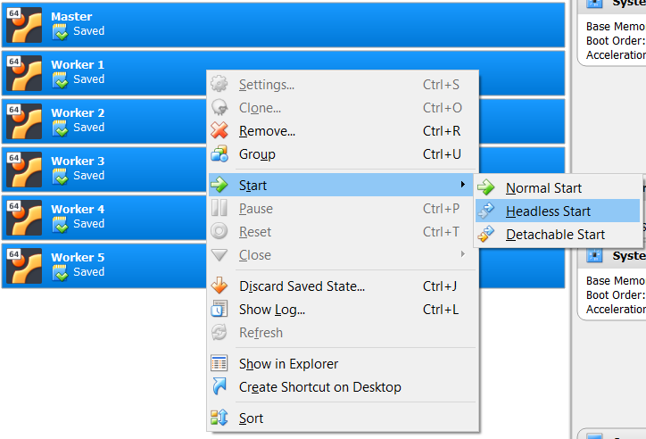

# Dynamic Workers

Here comes the interesting part, to avoid having to install ubuntu server on 5 different machines, we only had to do it once and reply on VirtualBox's cloning capabilities. As a reminder, we have created a base worker and updated **hadoop-env.sh**, **core-site.xml** and **hdfs-site.xml**, but these files do not contain any reference and are static. All that is left to do is change the static ip address and the machine's hostname to match what we have set previously in ~/.ssh/config and /etc/hosts.

## Static IP Addresses

We will use a base ip address of 196.168.56.XXX where XXX has values of:

* 200: master
* 222: base-worker
* 201: worker1
* 202: worker2
* 203: worker3
* 204: worker4
* 205: worker5


We have created a custom dynamic script that will perform the changes for us, to fully automate the cloning process. The file is included within the project and can be place anywhere on the Base-Worker to be cloned. Here is an explanation of the script.

We start by setting some variable that will be fed to the script on execution.

```
N="$1"
PREFIX="worker"
IP_ADDRESS_BASE="192.168.56.20"
NETWORK_INTERFACE="enp0s8"
```

We then change the hostname

```
hostnamectl set-hostname $PREFIX$N
hostname
```

And finally change the static ip address and preview the change

```
cat <<EOM > /etc/netplan/50-cloud-init.yaml
network:
    ethernets:
        enp0s3:
            addresses: []
            dhcp4: true
        $NETWORK_INTERFACE:
            addresses: [$IP_ADDRESS_BASE$N/16]
            dhcp4: no
    version: 2
EOM

netplan apply

ifconfig $NETWORK_INTERFACE | grep netmask | awk '{print $2}'| cut -f2 -d:
```

## Remote Access

Since we have defined ssh access on all nodes and added the host's key to all the VMs authorized keys files, we no longer need to start the VMs with their interface as they are of no use to us. we can simply run them in headless mode, meaning that they will be running in the background which reduces the load on our host machine.


<span class="caption">Figure 5. VMs Headless Start</span>

To access the VM we can simply run *ssh hduser@master* and replace master with any node hostname as we have defined them in our hosts file. This the standard way of accessing virtual machines, especially remote one that can be rented from the cloud.

To further simplify our workflow we have created aliases on our host machine and use a command line interface called [cmder](http://cmder.net/) that I recommend to any windows user, as it has built-in linux commands with support for git and ssh. And it has tabs!

```
alias sshbw = 'ssh hduser@base-worker'
alias sshm  = 'ssh hduser@master'
alias sshw1 = 'ssh hduser@worker1'
alias sshw2 = 'ssh hduser@worker2'
alias sshw3 = 'ssh hduser@worker3'
alias sshw4 = 'ssh hduser@worker4'
alias sshw5 = 'ssh hduser@worker5'
```

In short, to ssh into master, we simply run **sshm**. We then open 5 tabs where we run all our virtual machines.


<span class="caption">Figure 6. Remote Access to VMs</span>