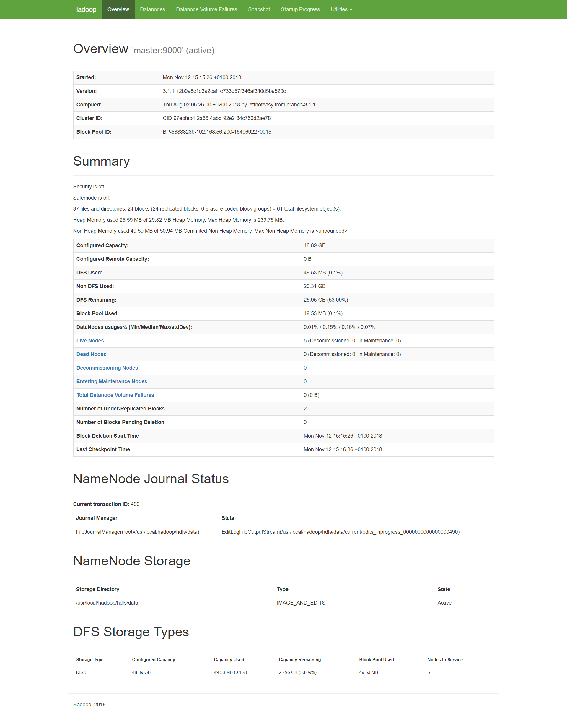
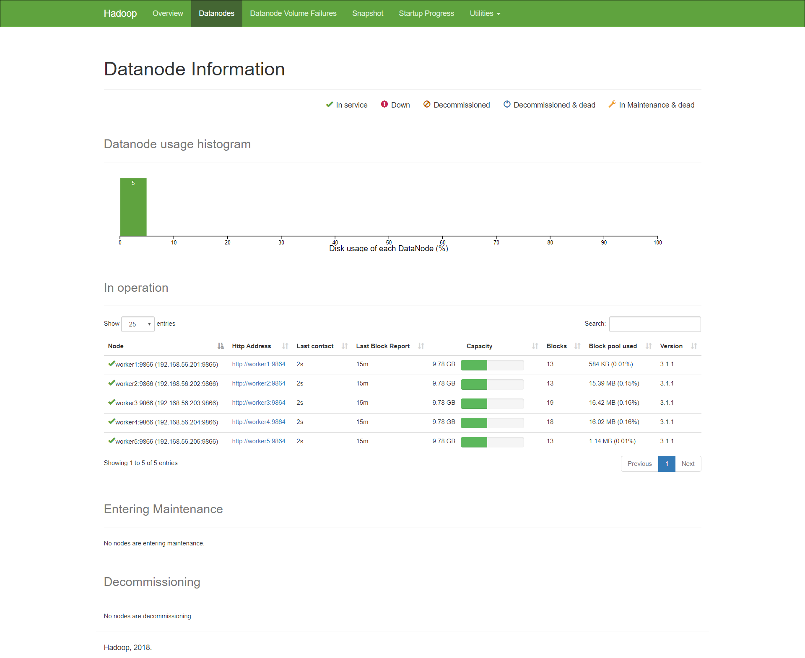
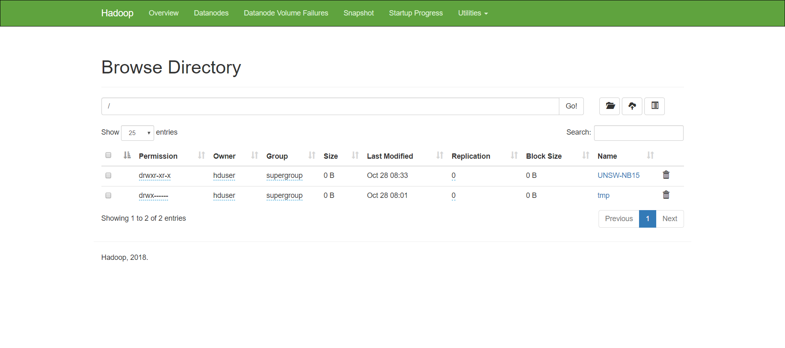

# Hadoop Cluster

## Command line

We are set and ready to start working on our hadoop cluster, we have our Master and 5 Worker nodes running (we do not need the base-worker VM anymore except for cloning new workers if resources allow it). First of all we need to format our HDFS as it needs to be set.

?> _hduser@master_ sudo ./bin/hdfs namenode -format

We then create two aliases to speed up the workflow:

```
alias hadoop-start-all = 'sudo /home/hduser/hadoop/sbin/start-dfs.sh && sudo /home/hduser/hadoop/sbin/start-yarn.sh'
alias hadoop-stop-all  = 'sudo /home/hduser/hadoop/sbin/stop-dfs.sh && sudo /home/hduser/hadoop/sbin/stop-yarn.sh'
```

On the master node, we need to run **hadoop-start-all** which will start the HDFS and YARN (Yet Another Resource Negotiator) that will manage our nodes.

?> _hduser@master_ hadoop-start-all


<span class="caption">Figure 7. hadoop-start-all command</span>


<span class="caption">Figure 8. Running jps on master</span>


<span class="caption">Figure 9. Running jps on worker</span>

## Overview

Once we're done with the commands, we can leave the terminal away and take a look at Hadoop's interface by visiting [master:9870](http://master:9870) from our host machine.


<span class="caption">Figure 10. Hadoop's overview page</span>

Amongst the most notable information:

* Configured Capacity:	48.89 GB *about 10Gb on every worker, 5 of them*
* DFS Used:	49.53 MB (0.1%)
* Live Nodes: 5 (Decommissioned: 0, In Maintenance: 0) *All 5 workers are up and running*

## Datanodes

We can see all the nodes that are part of our cluster, running without issues.

**Note:** Due to the screenshots being taken after the end of the project, as the HDFS already contains some files, the blocks initial values were 0 and capacity was minimal, the same goes for block pool used.


<span class="caption">Figure 11. Hadoop's datanodes page</span>

## Filesystem

**Note:** This section is a bit ahead of time, but we have decided to include it here since he are showcasing Hadoop's interface.


<span class="caption">Figure 12. Hadoop's file system page</span>

We can see that the root of our FS contains two folder: **tmp** that was created by yarn to store some temporary files and logs. If you're interested, here is the recursive content of the folder that can be viewed by running

?> _hduser@master_ ./bin/hdfs dfs -find /tmp -name \\* -print

```
/tmp
/tmp/hadoop-yarn
/tmp/hadoop-yarn/staging
/tmp/hadoop-yarn/staging/hduser
/tmp/hadoop-yarn/staging/hduser/.staging
/tmp/hadoop-yarn/staging/hduser/.staging/job_1540692322551_0001
/tmp/hadoop-yarn/staging/hduser/.staging/job_1540692322551_0001/job.jar
/tmp/hadoop-yarn/staging/hduser/.staging/job_1540692322551_0001/job.split
/tmp/hadoop-yarn/staging/hduser/.staging/job_1540692322551_0001/job.splitmetainfo
/tmp/hadoop-yarn/staging/hduser/.staging/job_1540692322551_0001/job.xml
/tmp/hadoop-yarn/staging/history
/tmp/hadoop-yarn/staging/history/done_intermediate
/tmp/hadoop-yarn/staging/history/done_intermediate/hduser
/tmp/hadoop-yarn/staging/history/done_intermediate/hduser/job_1540692322551_0002-1540710520565-hduser-Map+Reduce+%2D+Decision+Tree-1540710579220-0-0-FAILED-default-1540710533164.jhist
/tmp/hadoop-yarn/staging/history/done_intermediate/hduser/job_1540692322551_0002.summary
/tmp/hadoop-yarn/staging/history/done_intermediate/hduser/job_1540692322551_0002_conf.xml
/tmp/hadoop-yarn/staging/history/done_intermediate/hduser/job_1540692322551_0003-1540710887184-hduser-Map+Reduce+%2D+Decision+Tree-1540710935026-0-0-FAILED-default-1540710899501.jhist
/tmp/hadoop-yarn/staging/history/done_intermediate/hduser/job_1540692322551_0003.summary
/tmp/hadoop-yarn/staging/history/done_intermediate/hduser/job_1540692322551_0003_conf.xml
/tmp/hadoop-yarn/staging/history/done_intermediate/hduser/job_1540692322551_0004-1540711011999-hduser-Map+Reduce+%2D+Decision+Tree-1540711052130-0-0-FAILED-default-1540711022656.jhist
/tmp/hadoop-yarn/staging/history/done_intermediate/hduser/job_1540692322551_0004.summary
/tmp/hadoop-yarn/staging/history/done_intermediate/hduser/job_1540692322551_0004_conf.xml
/tmp/hadoop-yarn/staging/history/done_intermediate/hduser/job_1540692322551_0005-1540711171770-hduser-Map+Reduce+%2D+Decision+Tree-1540711235408-0-0-FAILED-default-1540711182531.jhist
/tmp/hadoop-yarn/staging/history/done_intermediate/hduser/job_1540692322551_0005.summary
/tmp/hadoop-yarn/staging/history/done_intermediate/hduser/job_1540692322551_0005_conf.xml
/tmp/hadoop-yarn/staging/history/done_intermediate/hduser/job_1540692322551_0006-1540711594548-hduser-Map+Reduce+%2D+Decision+Tree-1540711644256-0-0-FAILED-default-1540711606845.jhist
/tmp/hadoop-yarn/staging/history/done_intermediate/hduser/job_1540692322551_0006.summary
/tmp/hadoop-yarn/staging/history/done_intermediate/hduser/job_1540692322551_0006_conf.xml
/tmp/hadoop-yarn/staging/history/done_intermediate/hduser/job_1540692322551_0007-1540711978485-hduser-Map+Reduce+%2D+Decision+Tree-1540712045439-1-1-SUCCEEDED-default-1540711990096.jhist
/tmp/hadoop-yarn/staging/history/done_intermediate/hduser/job_1540692322551_0007.summary
/tmp/hadoop-yarn/staging/history/done_intermediate/hduser/job_1540692322551_0007_conf.xml
```

**NOTE:** The *find* command can be replaced by *ls* to view a specific folder's content without recursion.

The **UNSW-NB15** folder contains the training set file from the project's initial data folder that serves as input to the MapReduce program that will we talk about later as well its input which is the confusion matrix

?> _hduser@master_ ./bin/hdfs dfs -find /UNSW-NB15 -name \\* -print

```
/UNSW-NB15
/UNSW-NB15/confusion-matrix
/UNSW-NB15/confusion-matrix/_SUCCESS
/UNSW-NB15/confusion-matrix/part-r-00000
/UNSW-NB15/training-set.csv
```

## Replication & Blocks Location

We can see the information relative to the *training-set.csv* file and note that the default block size is 128MB rather than 64MB, this remains to be tweaked if necessary.

The change can be done on **hdfs-site.xml** as follows:

```angular2html
<property>
    <name>dfs.block.size</name>
    <value>128000000</value>
    <description>Block size</description>
</property>
```


<span class="caption">Figure 13. Training set information</span>

We can also note that the file only spans one block *Block 0* and is present of 3 datanodes (worker2, worker4, worker3) chosen at random and based on availability, process that is done by the master.


<span class="caption">Figure 14. Training set replication</span>
