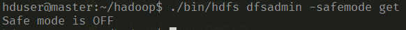

# Admin Commands

When working on hadoop and wanting to know about the cluster or control the cluster, following commands are handy:

## hdfs namenode -format

We have covered this command previously, it formats the HDFS from the namenode.

## hadoop namenode -recover -force

Recovers namenode metadata after a cluster failure.

## hadoop job

* **-submit** Submits a mapreduce job to the job tracker and then to the tasktrackers that run map and/or reduce tasks on the datanodes.

* **-status** Prints a job's status completion percentage
* **-list all** Lists all jobs

## hdfs dfsadmin -report

Output a summarized view of the hadoop cluster such as size, live nodes and their utilization.

?> _hduser@master_ ./bin/hdfs dfsadmin -report

```
Configured Capacity: 52493127680 (48.89 GB)
Present Capacity: 27824607232 (25.91 GB)
DFS Remaining: 27772637184 (25.87 GB)
DFS Used: 51970048 (49.56 MB)
DFS Used%: 0.19%
Replicated Blocks:
        Under replicated blocks: 2
        Blocks with corrupt replicas: 0
        Missing blocks: 0
        Missing blocks (with replication factor 1): 0
        Pending deletion blocks: 0
Erasure Coded Block Groups:
        Low redundancy block groups: 0
        Block groups with corrupt internal blocks: 0
        Missing block groups: 0
        Pending deletion blocks: 0

-------------------------------------------------
Live datanodes (5):

Name: 192.168.56.201:9866 (worker1)
Hostname: worker1
Decommission Status : Normal
Configured Capacity: 10498625536 (9.78 GB)
DFS Used: 598016 (584 KB)
Non DFS Used: 4362665984 (4.06 GB)
DFS Remaining: 5581873152 (5.20 GB)
DFS Used%: 0.01%
DFS Remaining%: 53.17%
Configured Cache Capacity: 0 (0 B)
Cache Used: 0 (0 B)
Cache Remaining: 0 (0 B)
Cache Used%: 100.00%
Cache Remaining%: 0.00%
Xceivers: 1
Last contact: Mon Nov 12 17:46:52 UTC 2018
Last Block Report: Mon Nov 12 14:15:36 UTC 2018
Num of Blocks: 13


Name: 192.168.56.202:9866 (worker2)
Hostname: worker2
Decommission Status : Normal
Configured Capacity: 10498625536 (9.78 GB)
DFS Used: 16146432 (15.40 MB)
Non DFS Used: 4362649600 (4.06 GB)
DFS Remaining: 5566341120 (5.18 GB)
DFS Used%: 0.15%
DFS Remaining%: 53.02%
Configured Cache Capacity: 0 (0 B)
Cache Used: 0 (0 B)
Cache Remaining: 0 (0 B)
Cache Used%: 100.00%
Cache Remaining%: 0.00%
Xceivers: 1
Last contact: Mon Nov 12 17:46:52 UTC 2018
Last Block Report: Mon Nov 12 15:57:20 UTC 2018
Num of Blocks: 14


Name: 192.168.56.203:9866 (worker3)
Hostname: worker3
Decommission Status : Normal
Configured Capacity: 10498625536 (9.78 GB)
DFS Used: 17219584 (16.42 MB)
Non DFS Used: 4362727424 (4.06 GB)
DFS Remaining: 5565190144 (5.18 GB)
DFS Used%: 0.16%
DFS Remaining%: 53.01%
Configured Cache Capacity: 0 (0 B)
Cache Used: 0 (0 B)
Cache Remaining: 0 (0 B)
Cache Used%: 100.00%
Cache Remaining%: 0.00%
Xceivers: 1
Last contact: Mon Nov 12 17:46:52 UTC 2018
Last Block Report: Mon Nov 12 14:15:36 UTC 2018
Num of Blocks: 19


Name: 192.168.56.204:9866 (worker4)
Hostname: worker4
Decommission Status : Normal
Configured Capacity: 10498625536 (9.78 GB)
DFS Used: 16801792 (16.02 MB)
Non DFS Used: 4450340864 (4.14 GB)
DFS Remaining: 5477994496 (5.10 GB)
DFS Used%: 0.16%
DFS Remaining%: 52.18%
Configured Cache Capacity: 0 (0 B)
Cache Used: 0 (0 B)
Cache Remaining: 0 (0 B)
Cache Used%: 100.00%
Cache Remaining%: 0.00%
Xceivers: 1
Last contact: Mon Nov 12 17:46:52 UTC 2018
Last Block Report: Mon Nov 12 14:43:28 UTC 2018
Num of Blocks: 19


Name: 192.168.56.205:9866 (worker5)
Hostname: worker5
Decommission Status : Normal
Configured Capacity: 10498625536 (9.78 GB)
DFS Used: 1204224 (1.15 MB)
Non DFS Used: 4362694656 (4.06 GB)
DFS Remaining: 5581238272 (5.20 GB)
DFS Used%: 0.01%
DFS Remaining%: 53.16%
Configured Cache Capacity: 0 (0 B)
Cache Used: 0 (0 B)
Cache Remaining: 0 (0 B)
Cache Used%: 100.00%
Cache Remaining%: 0.00%
Xceivers: 1
Last contact: Mon Nov 12 17:46:52 UTC 2018
Last Block Report: Mon Nov 12 14:15:36 UTC 2018
Num of Blocks: 14
```

## hdfs dfsadmin -safemode (get|enter|leave)

Safe mode maintenance command. Safe mode is a namenode state in which it  
* Does not accept changes to the name space (read-only)  
* Does not replicate or delete blocks.  

Safe mode is entered automatically at namenode startup, and leaves safe mode automatically when the configured minimum percentage of blocks satisfies the minimum replication condition. Safe mode can also be entered manually, but then it can only be turned off manually as well.


<span class="caption">Figure 20. Safe mode status</span>

## hadoop distcp

Allows to copy file or directories recursively within cluster or from one cluster to another cluster.

## hadoop fsck 

Used to check the HDFS file system. 

There are different arguments that can be passed with this command to emit different results:

* **-files** Displays all the files in HDFS while checking.
* **-blocks** Displays all the blocks in HDFS while checking.
* **-files -blocks** Displays all the blocks of the files in HDFS while checking.
* **-files -blocks -locations** Displays all the files' blocks' locations in HDFS while checking.


* **-delete** Deletes the corrupted files in HDFS.
* **-move** Moves the corrupted files to a particular directory, by default it will move to the /lost+found directory.

?> _hduser@master_ ./bin/hdfs fsck /

```
Connecting to namenode via http://master:9870/fsck?ugi=hduser&path=%2F
FSCK started by hduser (auth:SIMPLE) from /192.168.56.200 for path / at Mon Nov 12 17:54:53 UTC 2018

/tmp/hadoop-yarn/staging/hduser/.staging/job_1540692322551_0001/job.jar:  Under replicated BP-58838239-192.168.56.200-1540692270015:blk_1073741827_1003. Target Replicas is 10 but found 5 live replica(s), 0 decommissioned replica(s), 0 decommissioning replica(s).

/tmp/hadoop-yarn/staging/hduser/.staging/job_1540692322551_0001/job.split:  Under replicated BP-58838239-192.168.56.200-1540692270015:blk_1073741828_1004. Target Replicas is 10 but found 5 live replica(s), 0 decommissioned replica(s), 0 decommissioning replica(s).

Status: HEALTHY
 Number of data-nodes:  5
 Number of racks:               1
 Total dirs:                    12
 Total symlinks:                0

Replicated Blocks:
 Total size:    16967551 B
 Total files:   26
 Total blocks (validated):      25 (avg. block size 678702 B)
 Minimally replicated blocks:   25 (100.0 %)
 Over-replicated blocks:        0 (0.0 %)
 Under-replicated blocks:       2 (8.0 %)
 Mis-replicated blocks:         0 (0.0 %)
 Default replication factor:    3
 Average block replication:     3.16
 Missing blocks:                0
 Corrupt blocks:                0
 Missing replicas:              10 (11.235955 %)

Erasure Coded Block Groups:
 Total size:    0 B
 Total files:   0
 Total block groups (validated):        0
 Minimally erasure-coded block groups:  0
 Over-erasure-coded block groups:       0
 Under-erasure-coded block groups:      0
 Unsatisfactory placement block groups: 0
 Average block group size:      0.0
 Missing block groups:          0
 Corrupt block groups:          0
 Missing internal blocks:       0
FSCK ended at Mon Nov 12 17:54:53 UTC 2018 in 33 milliseconds


The filesystem under path '/' is HEALTHY
```

## hadoop balancer

* **start-balancer.sh** Balances the cluster, doesn't seem to give an output, in my case at least. Maybe due to an already balanced cluster since it is fresh with few files.
* **-threshold N** Limit balancing to only N% resources in the cluster

## The classic FileSystem commands

* **hadoop fs -put** Copy from remote location to HDFS
* **hadoop fs -get** Copy from HDFS to remote directory
* **hadoop fs -setrep -w N** Set the replication factor for a file to N


* **hadoop fs -mkdir** Create a directory (mydir) in HDFS
* **hadoop fs -ls** List files and directories in HDFS
* **hadoop fs -cat** View a file content
* **hadoop fs -rm** Delete a file in HDFS
* **hadoop fs -touchz** Create an empty file


* **hadoop fs -du** Check disk space usage in HDFS
* **hadoop fs -expunge** Empty trash on HDFS


* **hadoop fs -chgrp** Change group membership of a file
* **hadoop fs -chown** Change file ownership


* **hadoop fs -stat** Check the status of a file
* **hadoop fs -test -e** Check if file exists on HDFS
* **hadoop fs -test -z** Check if file is empty on HDFS
* **hadoop fs -test -d** Check if file1 is a directory on HDFS