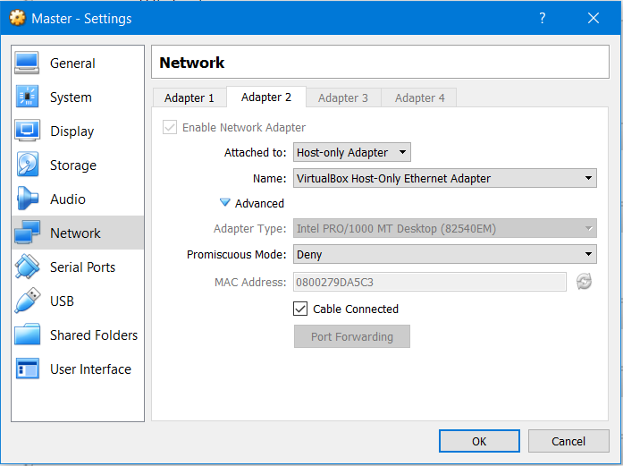

# Initial Setup

This section will delineate the initial setup required to start working on the project.

## Virtual Machines

First of all, we need to decide where our machines will reside, to overcome the need for multiple physical computers, we will use [Virtual Box](https://www.virtualbox.org/) to host our virtual machines.

Since [Hadoop](https://hadoop.apache.org/) is a Java application, thus can run on any JVM, we can use any operating system on our VMs, but we have decided to use [Ubuntu Server 18.10](https://wiki.ubuntu.com/CosmicCuttlefish/ReleaseNotes). Since the virtual machine will never be accessed through a graphical user interface (GUI) there is no real need for the desktop version, we will later see the means by which we access the different VMs.

We start by creating 2 virtual machines on which we install Ubuntu Server, the installation process is straight forward and relies on keyboard inputs since there is no GUI, future users should only pay attention to the keyboard layout to be used which can be automatically detected. A new addition to the 18.10 version is [Snaps](https://tutorials.ubuntu.com/tutorial/basic-snap-usage#0) and is basically a feature allowing to pre-install packages such as a LAMP stack, vagrant, etc... We will simply skip this step and only rely on a basic installation.

The machines we will be installing are Master and Base-Worker that will serve as a "template" for future workers to be created to avoid redoing the installation process. We will see this step in detail further down.

Once the installation is complete, we have our Master and Base-Worker VMs ready to go. During the installation process, we have set the username to "hduser" and the machine names respectively to "master" and "base-worker".


<span class="caption">Figure 1. List of initial virtual machines</span>

## Local Network

Each virtual machine has access to the outside network through its host but we still need to configure a local network that will link all the virtual machine to allow direct LAN communication. To do so we access the host network manager and set the configuration as follows :


<span class="caption">Figure 2. Host Network Manager part 1</span>


<span class="caption">Figure 3. Host Network Manager part 2</span>

Lastly we need to specify that our two initial virtual machines will be using the new network interface. We can set the VMs' configuration as follows:


<span class="caption">Figure 4. Virtual Machine Network Settings</span>

## Dependencies

We start by installing the required dependencies, we run the following commands on both VMs:

?> _hduser@master_ sudo apt-get update && sudo apt-get -y dist-upgrade
?> _hduser@master_ sudo apt-get -y install openjdk-8-jdk-headless

## Static IP Address

We need to set the ip addresses of our 2 VMs to be static and have fixed values, to do so:

?> _hduser@master_ sudo vim /etc/netplan/50-cloud-init.yaml

NetPlan is a new network configuration tool introduced in Ubuntu 17.10

We need to set the file's content to the following, while replace the IP_ADDRESS to 196.168.56.200 for the Master and 196.168.56.222 for the Base-Worker node.

```
network:
    ethernets:
        enp0s3:
            addresses: []
            dhcp4: true
        enp0s8:
            addresses: [IP_ADDRESS/16]
            dhcp4: no
    version: 2
```

## Hosts File

We also need to update the hosts file

?> _hduser@master_ sudo vim /etc/hosts

and add the following:

```
192.168.56.200	master
192.168.56.222	base-worker

192.168.56.201	worker1
192.168.56.202	worker2
192.168.56.203	worker3
192.168.56.204	worker4
192.168.56.205	worker5
```

The worker machines have not been created yet but it will be done further down.

The content above needs to be replicated on the host machine if you wish to access the VMs without running them on a GUI.

## SSH Access

Because we do not want/need to run the virtual machines with the default GUI since we've opted for ubuntu server that doesn't require any, we will setup SSH access between the host (our machine) and the virtual machines.

We first need to generate an SSH key on both the host (if it hasn't been done yet) and on the mater

?> _hduser@master_ ssh-keygen

We then copy both public keys from the host and master:

?> _hduser@master_ cat ~/.ssh/id_rsa.pub

And place both keys in ~/.ssh/authorized_keys of all nodes (master and base-worker) 

We then change the ~/.ssh/config file to contain the following:

```
Host master
    HostName master
    User hduser
    IdentityFile ~/.ssh/id_rsa

Host worker1
    HostName worker1
    User hduser
    IdentityFile ~/.ssh/id_rsa

Host worker2
    HostName worker2
    User hduser
    IdentityFile ~/.ssh/id_rsa

Host worker3
    HostName worker3
    User hduser
    IdentityFile ~/.ssh/id_rsa

Host worker4
    HostName worker4
    User hduser
    IdentityFile ~/.ssh/id_rsa

Host worker5
    HostName worker5
    User hduser
    IdentityFile ~/.ssh/id_rsa
```

Again, we have not created the worker nodes yet, it will come, patience!