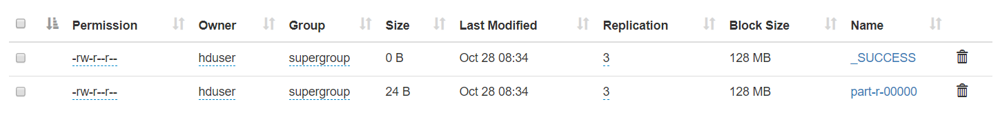

# Map Reduce

## Decision Tree Implementation

Now that we have specified which attributes to use on the decision tree and what window values to use, we can move to the Decision Tree program.

First of all we have created a Decision Tree program in Java simply to test the basic implementation the source code can be found in **Map Reduce/src/main/java/DecisionTreeImplementation.java** & uses a class to store the entries **Map Reduce/src/main/java/Record.java**

The program had an accuracy of 64.29%, correctly predicting 52937 of 82331 entries which is not bad considering we did not consider all the attributes and all their possible values as it requires a lot of processing and manual tweaking which is not the purpose of this project.

## MapReduce Implementation

We have followed [Hadoop 3.1.1 Map Reduce tutorial](https://hadoop.apache.org/docs/r3.1.1/hadoop-mapreduce-client/hadoop-mapreduce-client-core/MapReduceTutorial.html#Example:_WordCount_v1.0) to come up with our own map reduce program.

It requires 3 classes, we will refer to DecisionTree as DT:

* **DTMapper** The mapper class that will distribute the work to be done (the decision tree rules) to the worker nodes.
* **DTReducer** The reducer class that will collect the results of the mapper class from all the worker nodes.
* **DecisionTree** Technically a misnomer since this class has nothing to do with the decision tree, it is just the main class to be ran and takes care of setting the job, mapper, reducer, input file(s), output file(s) and make sure everything runs correctly.

We have decided to include the three classes in a single file **Map Reduce/src/main/java/DecisionTree.java**

## Files -> HDFS 

Now that we're done with our data set and our map reduce program, we need to move them over to the master node and then to HDFS

?> _me@host_ scp DecisionTree.java hduser@master:DecisionTree.java

?> _me@host_ scp training-set.csv hduser@master:training-set.csv

We start by creating a folder that will contain our files and move the training set

?> _hduser@master_ ./bin/hdfs dfs -mkdir -p /UNSW-NB15

?> _hduser@master_ ./bin/hdfs dfs -put UNSW_NB15_training-set.csv /UNSW-NB15/training-set.csv

## Running MapReduce Job

We need to compile our classes then run them

?> _hduser@master_ ./bin/hadoop com.sun.tools.javac.Main DecisionTree.java
?> _hduser@master_ jar cf DT.jar DecisionTree*.class

We then run the program, keeping in mind that we have already set the input and output within the program itself

?> _hduser@master_ ./bin/hadoop jar DT.jar DecisionTree

The result of running the MapReduce can be seen on the confusion matrix:

```
0,0	24881
0,1	12927
1,0	16467
1,1	28056
```

As expected, the accuracy is still of 64.29% the same as when running the decision tree program without map reduce. We can view the confusion matrix output from the interface's file system explorer:


<span class="caption">Figure 18. Confusion Matrix</span>

It is shown as a directory hence the "d" in its permissions "drwxr-xr-x" 


<span class="caption">Figure 19. Confusion Matrix Details</span>

Hadoop creates the **_SUCCESS** file to indicate that the job has been terminated successfully and a second file **part-r-00000** as **part-x-yyyyy** where:

* **x** is either 'm' or 'r', depending on whether the job was a map only job, or reduce
* **yyyyy** is the mapper or reducer task number (zero based)

And we can also see that the files are replicated properly in nodes (worker2, worker1, worker4) which are obviously different than the ones storing the training set as seen on figure 14 in [Hadoop Cluster > Replication & Blocks Location](http://localhost:3000/#/hadoop-cluster?id=replication-amp-blocks-location)

## Conclusion

The project is now complete we have successfully covered:

* Virtual machines initialization
* Hadoop installation
* Nodes configuration
* Hadoop's interface
* Decision Trees
* MapReduce
* HDFS (put, get, replicas, workers, master)

We need to cover one more thing that concerns the commands that a cluster admin can run.
